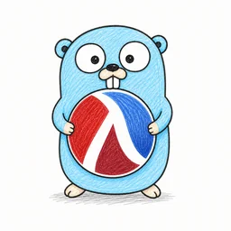

# Gorack

<p align="center">
  
</p>

Gorack lets you write Go programs with Lisp-style syntax and work with Go syntax as structured JSON.

With Gorack you can:

- Write Go programs using `#lang gorack`.
- Generate formatted `.go` files.
- Convert existing Go source into a versioned JSON syntax format.
- Convert Gorack JSON back into Go source.
- Read, inspect, transform, and write Go syntax from Racket.
- Build code generators and language tools that emit Go.

## Install

Choose the branch or tag that matches your Go version.

Version branches are named like:

```text
go1.26.5
```

Release tags include both the Gorack and Go versions:

```text
v0.1.0-go1.26.5
```

Clone a version branch:

```bash
git clone --branch go1.26.5 https://github.com/lambdaJasonYang/GoRack.git
cd GoRack
```

Requirements:

- The Go version listed in `MANIFEST.json`
- Racket 8.x
- GNU Make

Build the Go bridge:

```bash
make bridge
```

The bridge binary is written to:

```text
go-bridge/bin/gorack-go-bridge
```

## Quick start

Create `hello.rkt`:

```racket
#lang gorack

(package main
  (import "fmt")

  (defn main ()
    (:= name "Gorack")
    (call fmt.Println "Hello from" name)))
```

Run the Gorack program to create its JSON representation:

```bash
PLTCOLLECTS="$PWD:" racket hello.rkt > hello.wire.json
```

Convert the JSON to Go:

```bash
go-bridge/bin/gorack-go-bridge decode \
  -in hello.wire.json \
  -out hello.go
```

Run the generated program:

```bash
go run hello.go
```

Output:

```text
Hello from Gorack
```

The generated Go is formatted with the standard Go formatter.

## Install the Racket language

To use `#lang gorack` without setting `PLTCOLLECTS`, install the local Racket package:

```bash
raco pkg install --auto --link ./gorack
```

You can then run Gorack files directly:

```bash
racket hello.rkt > hello.wire.json
```

Remove the linked package with:

```bash
raco pkg remove gorack
```

## Language examples

### Packages and imports

```racket
(package main
  (import "fmt")
  (import "strings")
  ...)
```

### Functions

```racket
(defn add ([x int] [y int]) -> (int)
  (return (+ x y)))

(defn main ()
  (:= total (call add 20 22))
  (call fmt.Println total))
```

### Variables and assignment

```racket
(:= count 0)
(= count 10)
(+= count 1)

(var name string)
(var= [language string "Gorack"])
(const= Answer 42)
```

### Expressions

Gorack uses prefix notation:

```racket
(+ x y)
(- x y)
(* x y)
(/ x y)
(% x y)

(== x y)
(!= x y)
(< x y)
(<= x y)
(> x y)
(>= x y)

(&& ready valid)
(|| cached available)
(! failed)
```

### Function calls and selectors

```racket
(call fmt.Println "hello")
(call strings.ToUpper name)
(sel person Name)
person.Name
```

### Conditions

```racket
(if_ (> total 10)
  (call fmt.Println "large")
  (call fmt.Println "small"))
```

### Loops

Condition loop:

```racket
(for_ running
  (call work))
```

Three-part loop:

```racket
(for_ (:= i 0) (< i 10) (+= i 1)
  (call fmt.Println i))
```

Range loop:

```racket
(for-range := [index value] values
  (call fmt.Println index value))
```

### Structs

```racket
(type Person
  (struct_
    (Name string)
    (Age int)))
```

Create a struct value:

```racket
(:= person
  (composite Person
    [(kv Name "Ada")
     (kv Age 37)]))
```

Struct tags:

```racket
(type Message
  (struct_
    (Text string (tag (json text)))
    (Note string (tag (json note #:omitempty)))))
```

### Types and collections

```racket
(type UserID int)
(type-alias Reader = io.Reader)

(ptr Person)
(array 10 int)
(slice string)
(map_ string int)
```

More complete programs are available in the `examples/` directory.

## Convert Go to JSON

Build the bridge first:

```bash
make bridge
```

Convert a Go file into Gorack JSON:

```bash
go-bridge/bin/gorack-go-bridge encode \
  -in input.go \
  -out input.wire.json
```

The JSON contains the parsed Go syntax, node references, source positions, comments, tokens, and schema information.

## Convert JSON to Go

```bash
go-bridge/bin/gorack-go-bridge decode \
  -in input.wire.json \
  -out output.go
```

The bridge validates the document, rebuilds the Go syntax tree, and writes formatted Go source.

## Inspect the schema

Display the Go syntax schema included with the current release:

```bash
go-bridge/bin/gorack-go-bridge schema
```

## Round-trip an existing Go file

```bash
go-bridge/bin/gorack-go-bridge encode \
  -in server.go \
  -out server.wire.json

go-bridge/bin/gorack-go-bridge decode \
  -in server.wire.json \
  -out server.generated.go

go test server.generated.go
```

## Work with the JSON from Racket

The `gorack/go-kernel` modules provide readers, writers, generated node constructors, matchers, token definitions, transformations, and metadata helpers.

A simple JSON pass-through program:

```racket
#lang racket

(require gorack/go-kernel/wire)

(define unit
  (read-go-ast-json-file "input.wire.json"))

(write-go-ast-json-file
  "output.wire.json"
  unit)
```

This can be extended to inspect nodes, replace expressions, add declarations, attach annotations, or generate new Go files.

## Useful commands

Build the bridge:

```bash
make bridge
```

Run the Go and Racket tests included with the distribution:

```bash
make test
```

Run only Go tests:

```bash
make go-test
```

Run only Racket tests:

```bash
make racket-test
```

Remove built files:

```bash
make clean
```

## Release information

`MANIFEST.json` records the release details:

```json
{
  "gorackVersion": "0.1.0",
  "goVersion": "go1.26.5",
  "goAstSchemaHash": "sha256:...",
  "sourceCommit": "..."
}
```

Use the branch or tag matching the Go version used by your project.
